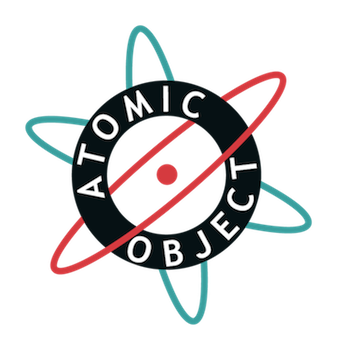

!SLIDE 
# Ruby for desktop applications? Yes we can. #
## [http://fletcherm.github.com/gr\_jug\_2011](http://fletcherm.github.com/gr_jug_2011) ##

!SLIDE
## (credit Mike Karlesky) ##

!SLIDE center
# Matt Fletcher #
# Atomic Object #

!SLIDE center

!SLIDE
## DOS simulators => Java + JRuby simulators ##

!SLIDE
# Demos! #

!SLIDE
# Techs #

!SLIDE
# Java #

!SLIDE
## (we all know what that is) ##

!SLIDE
# [JRuby](www.jruby.org) #

!SLIDE
## Ruby interpreter on the JVM ##

!SLIDE
## Production Simulator - JRuby 1.0 (2007) ##

!SLIDE
## Write Ruby ##
    @@@ Ruby
    class ConfigurationFacade
      def initialize
        @config = ...
      end

      def method_missing(name, *args, &block)
        @config[name.to_s]
      end

      def capital_investment
        @config["capital_investment"].present?
          ? @config["capital_investment"]
          : 0
      end
    end

!SLIDE
## Interface with Java ##
    @@@ Ruby
    class AgingReportView
      def view(parent)
        @table_model = ReadOnlyTableModel.new
        @aging = JTable.new(@table_model)
        @aging.row_selection_allowed = false
        @aging.cell_selection_enabled = true
      end
    end

!SLIDE
## Cross-pollinate for maximum goodness ##
    @@@ Ruby
    def invoke_later(&block)
      if javax.swing.SwingUtilities.
                     is_event_dispatch_thread
        block.call
      else
        ...
      end
    end

!SLIDE
    @@@ Ruby
    SwingUtilities.invoke_later(Runnable.impl do
      begin
        block.call
      rescue Exception => ex
        puts ex.message
        puts ex.backtrace.join("\n")
      end
    end)

!SLIDE
    @@@ Ruby
    def add_row(row)
      invoke_later do
        @table_model.add_row row.to_java
      end
    end

    def clear_rows
      invoke_later do
        @table_model.clear
      end
    end

!SLIDE
# RSpec for testing #
## 2120 unit tests ##
## 286 system tests ##

!SLIDE bullets incremental
# Core libs #
* Hardmock - mocking library (retired)
* Constructor - object construction
* DIY - dependency injection

!SLIDE
# Substance - look and feel #

!SLIDE
# Apache Batik - SVG #

!SLIDE
# Java scenegraph #

!SLIDE
# JFreeChart #

!SLIDE
# Beta distribution #

!SLIDE
# Bouncy Castle - encryption #

!SLIDE
# YAML - configuration #

!SLIDE
# NSIS - Windows installer #

!SLIDE
# Launch4J - Windows Java app launcher #

!SLIDE
# .app bundle on Mac #

!SLIDE
# shell script on Linux #

!SLIDE
# Development #

!SLIDE
# Presenter First #

!SLIDE center

!SLIDE
# Write Presenter tests first to define view & model behavior #

!SLIDE
# Just say 'When' #

!SLIDE
    @@@ Ruby
    class PlayPresenter
      constructor :model, :view
      
      def setup
        @view.when :play_clicked do
          if @model.paused?
            @model.resume
          else
            @model.play
          end
        end
      end
    end

!SLIDE
    @@@ Ruby
    describe Ui::PlayPresenter do
      before do
        create_mocks(:view, :model)

        @play = @view.trap.when :play_clicked
        @pause = @view.trap.when :pause_clicked

        Ui::PlayPresenter.new(@model, @view)
      end
    end

!SLIDE
    @@@ Ruby
    it 'pauses the sim when Pause is clicked' do
      @model.expects.pause
      @view.expects.hide_play
      @view.expects.show_pause

      @pause.trigger

      verify_mocks
    end

!SLIDE
    @@@ Ruby
    class PlayPresenter
      constructor :model, :view
      
      def setup
        @view.when :pause do
          @model.pause
          @view.hide_play
          @view.show_pause
        end
      end
    end

!SLIDE
    @@@ Ruby
    it 'starts the sim when Play is clicked' do
      @model.expects.paused?.returns false
      @model.expects.play

      @play.trigger

      verify_mocks
    end

!SLIDE
    @@@ Ruby
    it 'resumes the sim when Play
        is clicked after a Pause' do
      @model.expects.paused?.returns true
      @model.expects.resume

      @play.trigger

      verify_mocks
    end

!SLIDE
    @@@ Ruby
    class PlayPresenter
      constructor :model, :view
      
      def setup
        @view.when :play_clicked do
          if @model.paused?
            @model.resume
          else
            @model.play
          end
        end
      end
    end

!SLIDE
# Presenters tend to have simple, targetted tests and behavior #

!SLIDE
# Heavier behavior defined in models #

!SLIDE
# Views are thin walls around untestable code #

!SLIDE bullets incremental
## Usually GUI components, but could be anything hard to test ##
* hardware registers and ports
* Android activities & utilities
* things without interfaces (java)
* complex third-party api

!SLIDE
# 26, 29 MVP triples in each app #

!SLIDE bullets
# Resources #
* [http://fletcherm.github.com/gr\_jug\_2011](http://fletcherm.github.com/gr_jug_2011)
* [Atomic Object](http://www.atomicobject.com)
* [Presenter First](http://www.atomicobject.com/pages/Presenter+First)
* [JRuby](http:///www.jruby.org)

!SLIDE bullets
# Resources #
* [Ruby for Desktop Applications? Yes we can.](http://spin.atomicobject.com/2009/01/30/ruby-for-desktop-applications-yes-we-can)
* [Desktop Application Development in JRuby](http://spin.atomicobject.com/2007/11/12/desktop-application-development-in-jruby)
* [Rolling a JRuby desktop application](http://spin.atomicobject.com/2008/07/02/rolling-a-jruby-desktop-application)
* [Running a Ruby application with jruby-complete](http://spin.atomicobject.com/2010/02/01/running-a-ruby-application-with-jruby-complete)
* [Presenter First in GTK and C](http://spin.atomicobject.com/2010/07/13/presenter-first-in-gtk-and-c)
